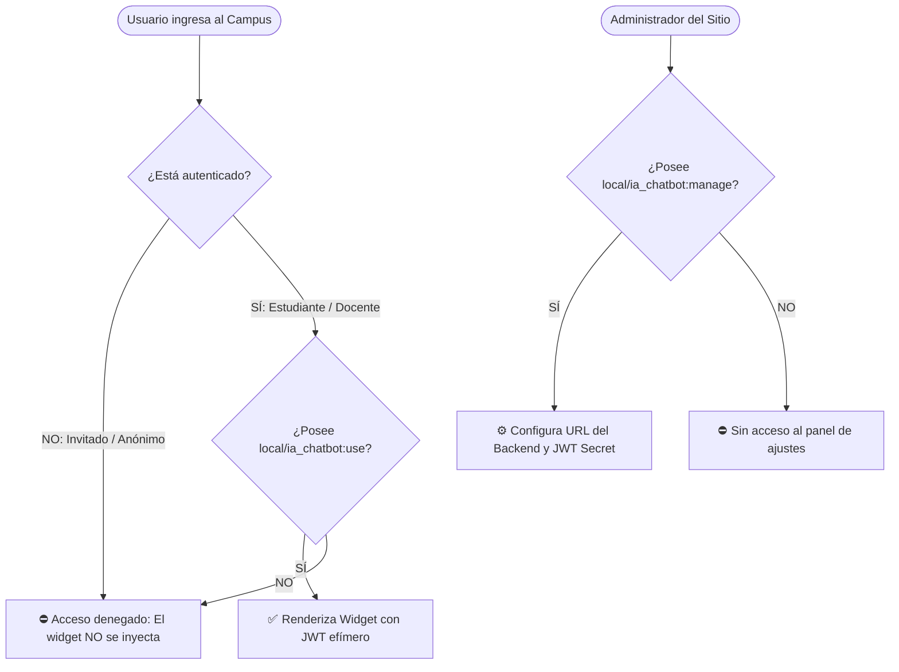
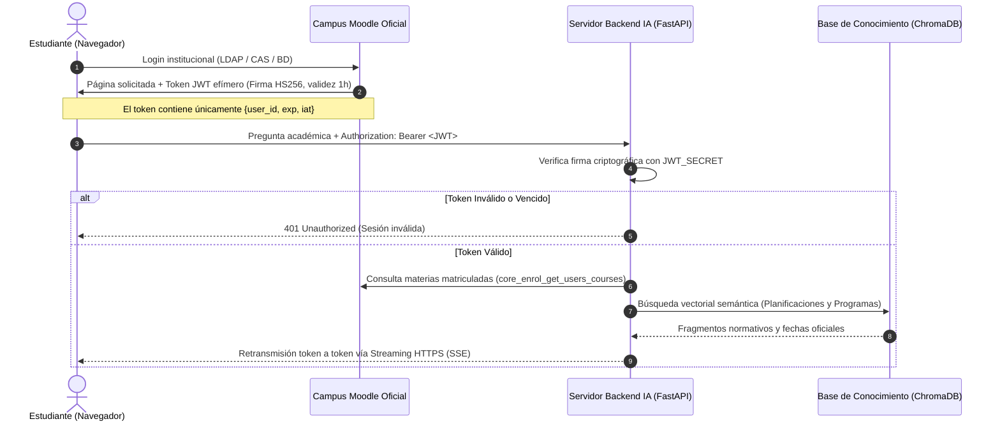
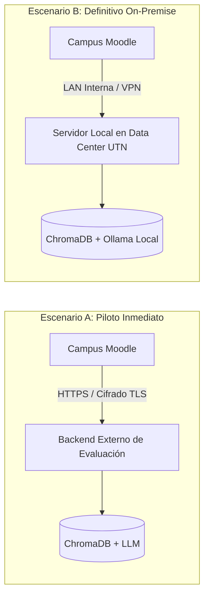

# Informe Técnico y de Seguridad Institucional: Integración de Asistente IA en Moodle

**Destinatarios:** Equipo de Administración de Campus Virtual, Dirección de Tecnologías de la Información (TI), Responsables de Seguridad Informática (CISO).  
**Versión del Componente:** `local_ia_chatbot` v1.1.2 (Build `2026090302`)  
**Fecha de Emisión:** Septiembre 2026  
**Clasificación:** Documentación Técnica de Evaluación e Implementación Institucional  

---

## 1. Resumen Ejecutivo y Alcance

El presente documento técnico tiene como propósito proporcionar transparencia absoluta sobre la arquitectura interna, permisos, flujo de datos y medidas de ciberseguridad del **Asistente Académico Virtual** desarrollado para integrarse en la plataforma institucional Moodle.

El objetivo pedagógico y operativo del asistente es brindar respuestas en lenguaje natural a los estudiantes sobre su vida académica:
- Fechas de exámenes parciales, recuperatorios y turnos de finales.
- Correlatividades y condiciones de cursado, regularidad y promoción.
- Programas analíticos y bibliografía obligatoria.
- Recordatorios de tareas y entregas pendientes del calendario.

> [!NOTE]
> Toda respuesta brindada por el asistente proviene exclusivamente de la **documentación oficial de cátedra y resoluciones de Consejo Directivo** previamente indexadas, eliminando alucinaciones y garantizando fidelidad normativa.

---

## 2. Pilares de Seguridad y Privacidad de la Información

> [!IMPORTANT]
> **Garantías Clave de Integridad:**
> 1. **Principio de Mínimo Privilegio**: El plugin opera de manera **estrictamente de solo lectura** (`captype: read`). No ejecuta `INSERT`, `UPDATE` o `DELETE` sobre las tablas estructurales de Moodle.
> 2. **Cero almacenamiento de credenciales**: El sistema **nunca almacena ni transmite contraseñas** de los usuarios. La autenticación se resuelve mediante tokens criptográficos efímeros HMAC-SHA256 (JWT) con caducidad fija.
> 3. **Aislamiento de Disponibilidad**: Si el servidor del backend de IA se desconecta o sufre un corte de energía, el Campus Virtual Moodle continúa operando al 100% de su rendimiento sin bloqueos ni caídas.
> 4. **Soberanía y Privacidad de Datos**: No se comparten datos con modelos públicos de terceros ni se realiza telemetría externa.

---

## 3. Desglose Estructural del Paquete ZIP (`local_ia_chatbot.zip`)

El paquete entregado pertenece a la categoría estándar de plugins de Moodle: **Plugin Local (`local`)**, ubicándose en el directorio `/var/www/html/local/ia_chatbot/`.

| Archivo / Recurso | Propósito Técnico | Impacto y Evaluación de Riesgo en Moodle |
| :--- | :--- | :--- |
| `version.php` | Declara metadatos, versión del componente (`2026090302`) y versión mínima de Moodle (Moodle 4.3+). | **Nulo**. Solo se evalúa durante la instalación/actualización. |
| `settings.php` | Agrega panel de configuración en *Administración del sitio ➔ Extensiones ➔ Plugins locales ➔ Asistente IA*. | **Bajo**. Almacena únicamente 3 variables (`backend_url`, `jwt_secret`, `token_expiry`) en la tabla estándar `mdl_config_plugins`. |
| `lib.php` | Registra el callback nativo `local_ia_chatbot_extend_navigation()`. Inyecta condicionalmente el script y estilo del widget solo si el usuario inició sesión. | **Bajo**. Se ejecuta de forma asíncrona; no retrasa el tiempo de carga de las páginas. |
| `externallib.php` | Implementa la API externa segura de Moodle (`external_api`) para obtener cursos matriculados y renovar tokens. | **Solo Lectura**. Solo responde a solicitudes AJAX autenticadas con la clave de sesión activa (`sesskey`). |
| `classes/jwt_helper.php` | Generador de tokens efímeros JWT firmados con algoritmo criptográfico estándar `HS256`. | **Nulo**. Cálculo criptográfico en memoria RAM (<1 ms). |
| `db/access.php` | Declara capacidades y permisos (`capabilities`) en el motor de roles de Moodle. | **Auditable y Configurable**. Permite a los administradores restringir o conceder acceso a discreción. |
| `db/services.php` | Registra el Web Service interno como servicio estrictamente de lectura (`type => 'read'`). | **Controlado**. Solo expone 2 funciones de lectura de contexto. |
| `widget/chatbot.js` | Script del widget flotante. Gestiona el renderizado de la interfaz y la conexión por streaming (`fetch ReadableStream`) con el backend IA. | **Cero impacto en el servidor Moodle**. Corre 100% en el navegador web del alumno. |
| `widget/chatbot.css` | Hoja de estilos con los colores institucionales (paleta Boost/UTN) y diseño accesible. | **Cero impacto en el servidor**. Archivo estático servido por caché web. |
| `lang/en/` y `lang/es/` | Paquetes de idioma oficial para traducción al español e inglés. | **Nativo de Moodle**. Utiliza el gestor de internacionalización del core. |

---

## 4. Matriz de Permisos y Capacidades de Acceso (`db/access.php`)

El plugin respeta el modelo de control de acceso basado en roles (RBAC) de Moodle y **no altera ningún rol ni capacidad preexistente** en el campus.

### Detalle de Capacidades Creadas

#### 1. `local/ia_chatbot:use`
- **Nivel de riesgo:** `RISK_PERSONAL` (Permite al bot consultar qué materias cursa el alumno para filtrar sus respuestas).
- **Tipo de operación:** `read` (Solo lectura).
- **Contexto:** `CONTEXT_SYSTEM`.
- **Roles con acceso por defecto:**
  - `student` (Estudiante): **Permitido**
  - `teacher` (Profesor sin permiso de edición): **Permitido**
  - `editingteacher` (Profesor titular / con permiso de edición): **Permitido**
  - `manager` (Gestor institucional): **Permitido**
- **Roles bloqueados:**
  - `guest` (Invitado / Usuario no registrado): **DENEGADO (PROHIBIDO)**

#### 2. `local/ia_chatbot:manage`
- **Nivel de riesgo:** `RISK_CONFIG`.
- **Tipo de operación:** `write` (Edición de parámetros del plugin).
- **Roles con acceso por defecto:** Exclusivo para administradores y gestores (`manager`).

---

## 5. Flujo de Autenticación y Desacoplamiento

El sistema opera mediante una arquitectura orientada a servicios desacoplada, donde el servidor de Moodle y el servidor de IA se comunican de forma segura:

> [!TIP]
> Al utilizar el encabezado estándar `Authorization: Bearer`, la solución es plenamente compatible con proxies inversos, balanceadores de carga, túneles seguros y WAFs institucionales.

---

## 6. Token de Sincronización Institucional (Ingesta Documental)

Para que el asistente conozca la información de las cátedras, el backend requiere un **Token de Servicio Web de Moodle** de alcance estrictamente limitado.

### Parámetros del Servicio Sugerido:
- **Nombre:** `Servicio Ingesta Asistente IA`.
- **Funciones exclusivas requeridas:**
  - `core_course_get_contents`: Lectura de recursos y archivos PDF (programas y planificaciones) de las materias seleccionadas.
  - `core_enrol_get_users_courses`: Lectura de la lista de cursos en los que un usuario está inscripto.
- **Garantías de Seguridad:**
  - ❌ **Sin permisos de modificación:** No puede crear, modificar ni eliminar actividades, tareas, usuarios ni notas.
  - ❌ **Sin acceso a datos personales sensibles:** No accede a DNI, contraseñas, teléfonos ni correos electrónicos.
  - 🔒 **Restricción por IP:** Moodle permite configurar este token para responder únicamente a la IP fija del servidor de IA.

---

## 7. Escenarios de Despliegue de la Infraestructura

Se presentan dos alternativas para la adopción técnica del proyecto:

### Comparativa de Escenarios:

| Criterio | Escenario A: Piloto / Evaluación | Escenario B: Definitivo On-Premise |
| :--- | :--- | :--- |
| **Ubicación del Backend** | Servidor de prueba externo / dedicado. | Servidor físico o VM en el Data Center de la Facultad. |
| **Tiempo de Puesta en Marcha** | **Inmediato (15 minutos)**: Solo instalar el ZIP en Moodle. | Requiere aprovisionamiento de VM y recursos de hardware (GPU opcional). |
| **Tráfico de Red** | HTTPS cifrado punto a punto. | Red local interna (LAN) sin salida al exterior. |
| **Consumo de Hardware Campus** | Cero (procesamiento externo). | Consumo dentro de la infraestructura institucional. |
| **Objetivo** | Validar la aceptación estudiantil y auditoría técnica sin compromiso de recursos. | Despliegue productivo final con 100% de soberanía de datos. |

---

## 8. Preguntas Frecuentes de Seguridad y CISO

> [!CAUTION]
> **¿El plugin almacena información confidencial en el navegador del alumno?**  
> No. El historial de conversación se guarda en `sessionStorage` (memoria temporal de la pestaña activa). Al cerrar la pestaña o hacer clic en "Cerrar sesión" en Moodle, el historial se borra automáticamente de la memoria local.

> [!NOTE]
> **¿Qué ocurre si el backend de IA no está disponible?**  
> El widget maneja el fallo de manera silenciosa y no intrusiva: muestra un mensaje amigable (*"No se pudo conectar con el asistente"*). La navegación, exámenes, entrega de trabajos y rendimiento del Campus Virtual continúan operando con normalidad.

> [!NOTE]
> **¿Es auditable el código fuente?**  
> Sí. El 100% del código del plugin está escrito en PHP nativo estándar de Moodle y JavaScript vanilla, sin dependencias externas ofuscadas, bajo licencia de código abierto GNU GPLv3.

---

## 9. Check-list de Instalación y Verificación

Para la verificación técnica por parte del Administrador de Campus:

- [ ] **1. Verificación del Archivo:** Comprobar integridad de [local_ia_chatbot.zip](file:///c:/Users/HP/Documents/BIS-chatbot/local_ia_chatbot.zip).
- [ ] **2. Carga en Moodle:** Acceder a *Administración del sitio ➔ Extensiones ➔ Instalar complementos* y cargar el ZIP.
- [ ] **3. Validación de Versión:** Moodle confirmará la versión `1.1.2` (Build `2026090302`) sin advertencias de compatibilidad.
- [ ] **4. Configuración:** Ingresar a *Plugins locales ➔ Asistente IA* y definir la URL del backend y el JWT Secret.
- [ ] **5. Validación de Roles:** Verificar en *Definición de roles* que `local/ia_chatbot:use` no esté asignado al rol `Invitado` (Guest).
- [ ] **6. Prueba de Usuario:** Iniciar sesión con un usuario de prueba en Moodle; el widget aparecerá en la esquina inferior derecha con el ícono y paleta institucional.

---

**Equipo de Desarrollo e Integración — BIS**  
*Facultad Regional Resistencia — Universidad Tecnológica Nacional*
